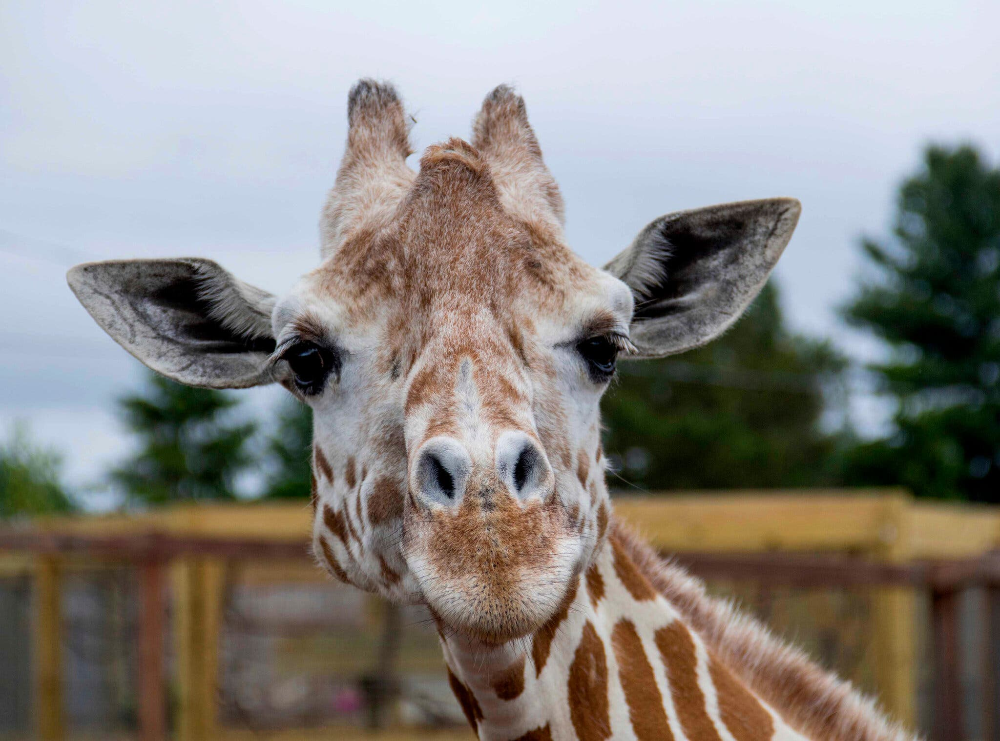

```{r setup, include=FALSE}
knitr::opts_chunk$set(echo = TRUE)
```

# Lab 1a. Species Distribution Modeling - Exploratory Data Analysis

## 2.1 Install Packages 
```{r}
# load packages, installing if missing
if (!require(librarian)){
  install.packages("librarian")
  library(librarian)
} 
librarian::shelf(
  dismo, dplyr, DT, ggplot2, here, htmltools, leaflet, mapview, purrr, raster, readr, rgbif, rgdal, rJava, sdmpredictors, sf, spocc, tidyr, geojsonio, tidyverse)
select <- dplyr::select # overwrite raster::select

# set random seed for reproducibility
set.seed(42)

# directory to store data
dir_data <- here("data/sdm") 
dir.create(dir_data, showWarnings = F)
```
## 2.2 Choose a Species 

**I have chosen the giraffe, Giraffa, as my species for this lab. I have always loved large mammals and giraffes are just especially majestic and interesting animals.** 



## 2.3 Get Species Observations 
```{r}
obs_csv <- file.path(dir_data, "obs.csv")
obs_geo <- file.path(dir_data, "obs.geojson")
redo    <- TRUE

if (!file.exists(obs_geo) | redo){
  # get species occurrence data from GBIF with coordinates
  (res <- spocc::occ(
    query = 'Giraffa',
    from = 'gbif', has_coords = T, limit = 10000))
  
  # extract data frame from result
  #df <- res$gbif$data[[1]]  # from Ben 
  df <- res$gbif$data[[1]] %>% 
    filter(longitude > -26.41,
           longitude < 54.98,
           latitude > -36.21,
           latitude < 38.65) # filter for just the African continent 
  readr::write_csv(df, obs_csv)
  
  # convert to points of observation from lon/lat columns in data frame
  obs <- df %>% 
    sf::st_as_sf(
      coords = c("longitude", "latitude"),
      crs = st_crs(4326)) %>% 
    select(prov, key) # save space (joinable from obs_csv)
  sf::write_sf(obs, obs_geo, delete_dsn=T)
}
obs <- sf::read_sf(obs_geo)
nrow(obs) # number of rows
```

```{r}
# show points on map
mapview::mapview(obs, map.types = "Stamen.Terrain")
```
Question 1. How many observations total are in GBIF for your species? (Hint: ?occ)
**There are 9,225 giraffe observations in GBIF, filtering for observations on the African continent only. Before filtering, there were 9,300 observations total in GBIF.**

Question 2. Do you see any odd observations, like marine species on land or vice versa? If so, please see the Data Cleaning and explain what you did to fix or remove these points.
**There are no odd observations, and all of the points are on land; however, I did decide to filter my observations to those appearing only on the African continent. The observations were most abundant here to start with anyways, and since they are native to Africa I felt that it was a good idea to build the species distribution model based on their native habitat. To filter the observations, I included observations that fell within a bounding box of the African continent.**


## 2.4 Get Environmental Data 

## 2.4.1 Presence
```{r}
dir_env <- file.path(dir_data, "env")

# set a default data directory
options(sdmpredictors_datadir = dir_env)

# choosing terrestrial
env_datasets <- sdmpredictors::list_datasets(terrestrial = TRUE, marine = FALSE)

# show table of datasets
env_datasets %>% 
  select(dataset_code, description, citation) %>% 
  DT::datatable()
```


```{r}
# choose datasets for a vector
env_datasets_vec <- c("WorldClim", "ENVIREM")

# get layers
env_layers <- sdmpredictors::list_layers(env_datasets_vec)
DT::datatable(env_layers)
```

```{r}
# choose layers after some inspection and perhaps consulting literature
env_layers_vec <- c("WC_alt", "WC_bio1", "WC_bio2", "ER_climaticMoistureIndex", "ER_topoWet")

# get layers
env_stack <- load_layers(env_layers_vec)

# interactive plot layers, hiding all but first (select others)
# mapview(env_stack, hide = T) # makes the html too big for Github
plot(env_stack, nc=2)
```
Question: What environmental layers did you choose as predictors? Can you find any support for these in the literature?
**I decided to use the following layers as predictors: WC_alt, WC_bio1, WC_bio2, ER_topoWet, and ER_climaticMoistureIndex. Because giraffes are typically found at low altitudes, in arid environments like grasslands and savannas, I thought the climatic moisture index and altitude layer were important to include. Additionally, I wanted to include WC_bio1 and WC_bio2 to see if temperature played a role in determining the giraffe habitat since they prefer to live in warmer envrieonments. Lastly, I included the ER_topoWet layer because giraffes typically prefer dry climates and I thought this layer would be a good predictor.**

```{r}
obs_hull_geo  <- file.path(dir_data, "obs_hull.geojson")
env_stack_grd <- file.path(dir_data, "env_stack.grd")

if (!file.exists(obs_hull_geo) | redo){
  # make convex hull around points of observation
  obs_hull <- sf::st_convex_hull(st_union(obs))
  
  # save obs hull
  write_sf(obs_hull, obs_hull_geo)
}
obs_hull <- read_sf(obs_hull_geo)

# show points on map
mapview(
  list(obs, obs_hull))
```

```{r}
if (!file.exists(env_stack_grd) | redo){
  obs_hull_sp <- sf::as_Spatial(obs_hull)
  env_stack <- raster::mask(env_stack, obs_hull_sp) %>% 
    raster::crop(extent(obs_hull_sp))
  writeRaster(env_stack, env_stack_grd, overwrite=T)  
}
env_stack <- stack(env_stack_grd)

# show map
# mapview(obs) + 
#   mapview(env_stack, hide = T) # makes html too big for Github
plot(env_stack, nc=2)
```

## 2.4.2 Pseudo-Absence 
```{r}
absence_geo <- file.path(dir_data, "absence.geojson")
pts_geo     <- file.path(dir_data, "pts.geojson")
pts_env_csv <- file.path(dir_data, "pts_env.csv")

if (!file.exists(absence_geo) | redo){
  # get raster count of observations
  r_obs <- rasterize(
    sf::as_Spatial(obs), env_stack[[1]], field=1, fun='count')
  
  # show map
  # mapview(obs) + 
  #   mapview(r_obs)
  
  # create mask for 
  r_mask <- mask(env_stack[[1]] > -Inf, r_obs, inverse=T)
  
  # generate random points inside mask
  absence <- dismo::randomPoints(r_mask, nrow(obs)) %>% 
    as_tibble() %>% 
    st_as_sf(coords = c("x", "y"), crs = 4326)
  
  write_sf(absence, absence_geo, delete_dsn=T)
}
absence <- read_sf(absence_geo)

# show map of presence, ie obs, and absence
mapview(obs, col.regions = "green") + 
  mapview(absence, col.regions = "gray")

```

```{r}
if (!file.exists(pts_env_csv) | redo){

  # combine presence and absence into single set of labeled points 
  pts <- rbind(
    obs %>% 
      mutate(
        present = 1) %>% 
      select(present, key),
    absence %>% 
      mutate(
        present = 0,
        key     = NA)) %>% 
    mutate(
      ID = 1:n()) %>% 
    relocate(ID)
  write_sf(pts, pts_geo, delete_dsn=T)

  # extract raster values for points
  pts_env <- raster::extract(env_stack, as_Spatial(pts), df=TRUE) %>% 
    tibble() %>% 
    # join present and geometry columns to raster value results for points
    left_join(
      pts %>% 
        select(ID, present),
      by = "ID") %>% 
    relocate(present, .after = ID) %>% 
    # extract lon, lat as single columns
    mutate(
      #present = factor(present),
      lon = st_coordinates(geometry)[,1],
      lat = st_coordinates(geometry)[,2]) %>% 
    select(-geometry)
  write_csv(pts_env, pts_env_csv)
}
pts_env <- read_csv(pts_env_csv)

pts_env %>% 
  # show first 10 presence, last 10 absence
  slice(c(1:10, (nrow(pts_env)-9):nrow(pts_env))) %>% 
  DT::datatable(
    rownames = F,
    options = list(
      dom = "t",
      pageLength = 20))
```

## 2.5 Term Plots
```{r}
pts_env %>% 
  select(-ID) %>% 
  mutate(
    present = factor(present)) %>% 
  pivot_longer(-present) %>% 
  ggplot() +
  geom_density(aes(x = value, fill = present)) + 
  scale_fill_manual(values = alpha(c("gray", "green"), 0.5)) +
  scale_x_continuous(expand=c(0,0)) +
  scale_y_continuous(expand=c(0,0)) +
  theme_bw() + 
  facet_wrap(~name, scales = "free") +
  theme(
    legend.position = c(1, 0),
    legend.justification = c(1, 0))
```

# Lab 1b. Species Distribution Modeling - Logistic Regression

## 1 Explore (cont'd)
```{r}
librarian::shelf(
  DT, dplyr, dismo, GGally, here, readr, tidyr)
select <- dplyr::select # overwrite raster::select
options(readr.show_col_types = F)

dir_data    <- here("data/sdm")
pts_env_csv <- file.path(dir_data, "pts_env.csv")

pts_env <- read_csv(pts_env_csv)
nrow(pts_env)

datatable(pts_env, rownames = F)
```

```{r}
GGally::ggpairs(
  select(pts_env, -ID),
  aes(color = factor(present)))
```

## 2 Logistic Regression

## 2.1 Setup data 
```{r}
# setup model data
d <- pts_env %>% 
  select(-ID) %>%  # remove terms we don't want to model
  tidyr::drop_na() # drop the rows with NA values
nrow(d)
```

## 2.2 Linear Model 
```{r}
# fit a linear model
mdl <- lm(present ~ ., data = d)
summary(mdl)
```

```{r}
y_predict <- predict(mdl, d, type="response")
y_true    <- d$present

range(y_predict)
```

```{r}
range(y_true)
```

## 2.3 Generalized Linear Model 
```{r}
# fit a generalized linear model with a binomial logit link function
mdl <- glm(present ~ ., family = binomial(link="logit"), data = d)
summary(mdl)

```

```{r}
y_predict <- predict(mdl, d, type="response")

range(y_predict)
```

```{r}
# show term plots
termplot(mdl, partial.resid = TRUE, se = TRUE, main = F, ylim = "free")
```

## 2.4 Generalized Additive Model 
```{r}
librarian::shelf(mgcv)

# fit a generalized additive model with smooth predictors
mdl <- mgcv::gam(
  formula = present ~ s(WC_alt) + s(WC_bio1) + 
    s(WC_bio2) + s(ER_climaticMoistureIndex) + s(ER_topoWet) + s(lon) + s(lat), 
  family = binomial, data = d)
summary(mdl)

```

```{r}
# show term plots
plot(mdl, scale=0)
```

Question: Which GAM environmental variables, and even range of values, seem to contribute most towards presence (above 0 response) versus absence (below 0 response)?

**Altitude above about 2000, Bio_1 above about 26, Bio_2 above about 17, ER_topo_Wet under 9, and latitude from about -40 to -20 seem to contribute most towards presence. On the flip side, Bio_1 from about 0-20, ER_climaticMoistureIndex from -1 and above, ER_topoWet above 14, and longitude froom about -7 to 0 seem to contribute the most to absense.**


## 2.5 Maxent (Maximum Entropy)
```{r}
# load extra packages
librarian::shelf(
  maptools, sf)

mdl_maxent_rds <- file.path(dir_data, "mdl_maxent.rds")

# show version of maxent
if (!interactive())
maxent()
```

```{r}
# get environmental rasters
# NOTE: the first part of Lab 1. SDM - Explore got updated to write this clipped environmental raster stack
env_stack_grd <- file.path(dir_data, "env_stack.grd")
env_stack <- stack(env_stack_grd)
plot(env_stack, nc=2)
```

```{r}
# get presence-only observation points (maxent extracts raster values for you)
obs_geo <- file.path(dir_data, "obs.geojson")
obs_sp <- read_sf(obs_geo) %>% 
  sf::as_Spatial() # maxent prefers sp::SpatialPoints over newer sf::sf class

# fit a maximum entropy model
if (!file.exists(mdl_maxent_rds)){
  mdl <- maxent(env_stack, obs_sp)
  readr::write_rds(mdl, mdl_maxent_rds)
}
mdl <- read_rds(mdl_maxent_rds)
```

```{r}
# plot variable contributions per predictor
plot(mdl)
```

```{r}
# plot term plots
response(mdl)
```


Question: Which Maxent environmental variables, and even range of values, seem to contribute most towards presence (closer to 1 response) and how might this differ from the GAM results?

**ER_climaticMoistureIndex and WC_bio1 seem to contribute the most towards giraffe presence in the maxent model. This is different from the GAM results because while it seemed like ER_climaticMoistureIndex did influence presence, it was not as obvious how much it contributed to presence.**


```{r}
# predict
y_predict <- predict(env_stack, mdl) #, ext=ext, progress='')

plot(y_predict, main='Maxent, raw prediction')
data(wrld_simpl, package="maptools")
plot(wrld_simpl, add=TRUE, border='dark grey')
```
# Lab 1c. Species Distribution Modeling - Decision Trees

## 1. Setup  
```{r}
# global knitr chunk options
knitr::opts_chunk$set(
  warning = FALSE, 
  message = FALSE)

# load packages
librarian::shelf(
  caret,       # m: modeling framework
  dplyr, ggplot2 ,here, readr, 
  pdp,         # X: partial dependence plots
  rpart,       # m: recursive partition modeling
  rpart.plot,  # m: recursive partition plotting
  rsample,     # d: split train/test data
  skimr,       # d: skim summarize data table
  vip)         # X: variable importance

# options
options(
  scipen = 999,
  readr.show_col_types = F)
set.seed(42)

# graphical theme
ggplot2::theme_set(ggplot2::theme_light())

# paths
dir_data    <- here("data/sdm")
pts_env_csv <- file.path(dir_data, "pts_env.csv")

# read data
pts_env <- read_csv(pts_env_csv)
d <- pts_env %>% 
  select(-ID) %>%                   # not used as a predictor x
  mutate(
    present = factor(present)) %>%  # categorical response
  na.omit()                         # drop rows with NA
skim(d)
```

## 1.1 Split data into training and testing
```{r}
# create training set with 80% of full data
d_split  <- rsample::initial_split(d, prop = 0.8, strata = "present")
d_train  <- rsample::training(d_split)

# show number of rows present is 0 vs 1
table(d$present)
```

```{r}
table(d_train$present)
```
## 2 Decision Trees

## 2.1 Partition, depth=1
```{r}
# run decision stump model
mdl <- rpart(
  present ~ ., data = d_train, 
  control = list(
    cp = 0, minbucket = 5, maxdepth = 1))
mdl
```

```{r}
# plot tree 
par(mar = c(1, 1, 1, 1))
rpart.plot(mdl)
```
## 2.2 Partition, depth=default

```{r}
# decision tree with defaults
mdl <- rpart(present ~ ., data = d_train)
mdl
```

```{r}
rpart.plot(mdl)

# plot complexity parameter
plotcp(mdl)

# rpart cross validation results
mdl$cptable
```

Question: Based on the complexity plot threshold, what size of tree is recommended?

**A size of 8 is recommended based on the complexity plot threshold.**

## 2.3 Feature interpretation
```{r}
# caret cross validation results
mdl_caret <- train(
  present ~ .,
  data       = d_train,
  method     = "rpart",
  trControl  = trainControl(method = "cv", number = 10),
  tuneLength = 20)

ggplot(mdl_caret)
```
```{r}
vip(mdl_caret, num_features = 40, bar = FALSE)
```

Question: what are the top 3 most important variables of your model?

**Based on the plot above, lat, lon, and ER_climaticMoistureIndex are the most important variables of my model.**

```{r}
# Construct partial dependence plots
p1 <- partial(mdl_caret, pred.var = "lat") %>% autoplot()
p2 <- partial(mdl_caret, pred.var = "WC_bio2") %>% autoplot()
p3 <- partial(mdl_caret, pred.var = c("lat", "WC_bio2")) %>% 
  plotPartial(levelplot = FALSE, zlab = "yhat", drape = TRUE, 
              colorkey = TRUE, screen = list(z = -20, x = -60))

# Display plots side by side
gridExtra::grid.arrange(p1, p2, p3, ncol = 3)
```

# 3 Random Forests 
```{r}
# load additional packages
librarian::shelf(
  ranger)  # random forest modeling
```

## 3.1 Fit
```{r}
# number of features
n_features <- length(setdiff(names(d_train), "present"))

# fit a default random forest model
mdl_rf <- ranger(present ~ ., data = d_train)

# get out of the box RMSE
(default_rmse <- sqrt(mdl_rf$prediction.error))
```

## 3.2 Feature Interpretation 
```{r}
# re-run model with impurity-based variable importance
mdl_impurity <- ranger(
  present ~ ., data = d_train,
  importance = "impurity")

# re-run model with permutation-based variable importance
mdl_permutation <- ranger(
  present ~ ., data = d_train,
  importance = "permutation")
p1 <- vip::vip(mdl_impurity, bar = FALSE)
p2 <- vip::vip(mdl_permutation, bar = FALSE)

gridExtra::grid.arrange(p1, p2, nrow = 1)
```

Question: How might variable importance differ between rpart and RandomForest in your model outputs?

**Besides lat and lon, WC_bio1 and ER_climaticMoistureIndex are the two most important variables in both the rpart model and the random forest model. The bottom three variables are also the same in both models, with ER_topoWet being the least important variable.**

# Lab 1d. Species Distribution Modeling - Evaluate Models

## 1. Setup 
```{r}
# global knitr chunk options
knitr::opts_chunk$set(
  warning = FALSE, 
  message = FALSE)

# load packages
librarian::shelf(
  dismo, # species distribution modeling: maxent(), predict(), evaluate(), 
  dplyr, ggplot2, GGally, here, maptools, readr, 
  raster, readr, rsample, sf,
  usdm)  # uncertainty analysis for species distribution models: vifcor()
select = dplyr::select

# options
set.seed(42)
options(
  scipen = 999,
  readr.show_col_types = F)
ggplot2::theme_set(ggplot2::theme_light())

# paths
dir_data      <- here("data/sdm")
pts_geo       <- file.path(dir_data, "pts.geojson")
env_stack_grd <- file.path(dir_data, "env_stack.grd")
mdl_maxv_rds  <- file.path(dir_data, "mdl_maxent_vif.rds")

# read points of observation: presence (1) and absence (0)
pts <- read_sf(pts_geo)

# read raster stack of environment
env_stack <- raster::stack(env_stack_grd)
```

## 1.1 Split observations into training and testing
```{r}
# create training set with 80% of full data
pts_split  <- rsample::initial_split(
  pts, prop = 0.8, strata = "present")
pts_train  <- rsample::training(pts_split)
pts_test   <- rsample::testing(pts_split)

pts_train_p <- pts_train %>% 
  filter(present == 1) %>% 
  as_Spatial()
pts_train_a <- pts_train %>% 
  filter(present == 0) %>% 
  as_Spatial()
```

## 2 Calibrate: Model Selection
```{r}
# show pairs plot before multicollinearity reduction with vifcor()
pairs(env_stack)
```
```{r}
# calculate variance inflation factor per predictor, a metric of multicollinearity between variables

vif(env_stack)
```

```{r}
# stepwise reduce predictors, based on a max correlation of 0.7 (max 1)
v <- vifcor(env_stack, th=0.7) 
v
```
```{r}
# reduce enviromental raster stack by 
env_stack_v <- usdm::exclude(env_stack, v)

# show pairs plot after multicollinearity reduction with vifcor()
pairs(env_stack_v)
```
```{r}
# fit a maximum entropy model
if (!file.exists(mdl_maxv_rds)){
  mdl_maxv <- maxent(env_stack_v, sf::as_Spatial(pts_train))
  readr::write_rds(mdl_maxv, mdl_maxv_rds)
}
mdl_maxv <- read_rds(mdl_maxv_rds)

# plot variable contributions per predictor
plot(mdl_maxv)

```

Question: Which variables were removed due to multicollinearity and what is the rank of most to least important remaining variables in your model?

**None of my variables had colliniarity problems, so none were removed. ER_climaticMoistureIndex was the most important, followed by WC_bio1, WC_alt, ER_topoWet, and WC_bio2. The bottom three variables all just barely contributed.**


```{r}
# plot term plots
response(mdl_maxv)
```


```{r}
# predict
y_maxv <- predict(env_stack, mdl_maxv) #, ext=ext, progress='')

plot(y_maxv, main='Maxent, raw prediction')
data(wrld_simpl, package="maptools")
plot(wrld_simpl, add=TRUE, border='dark grey')
```

## 3 Evaluate: Model Performance

## 3.1 Area Under the Curve (AUC), Reciever Operater Characteristic (ROC) Curve and Confusion Matrix
```{r}
pts_test_p <- pts_test %>% 
  filter(present == 1) %>% 
  as_Spatial()
pts_test_a <- pts_test %>% 
  filter(present == 0) %>% 
  as_Spatial()

y_maxv <- predict(mdl_maxv, env_stack)
#plot(y_maxv)

e <- dismo::evaluate(
  p     = pts_test_p,
  a     = pts_test_a, 
  model = mdl_maxv,
  x     = env_stack)
e
```

```{r}
plot(e, 'ROC')

thr <- threshold(e)[['spec_sens']]
thr
```

```{r}
p_true <- na.omit(raster::extract(y_maxv, pts_test_p) >= thr)
a_true <- na.omit(raster::extract(y_maxv, pts_test_a) < thr)

# (t)rue/(f)alse (p)ositive/(n)egative rates
tpr <- sum(p_true)/length(p_true)
fnr <- sum(!p_true)/length(p_true)
fpr <- sum(!a_true)/length(a_true)
tnr <- sum(a_true)/length(a_true)

matrix(
  c(tpr, fnr,
    fpr, tnr), 
  nrow=2, dimnames = list(
    c("present_obs", "absent_obs"),
    c("present_pred", "absent_pred")))
```

```{r}
# add point to ROC plot
plot(e, 'ROC')
points(fpr, tpr, pch=23, bg="blue")
```

```{r}
plot(y_maxv > thr)
```

